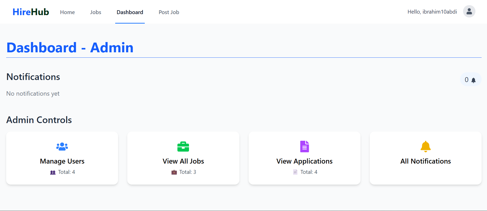
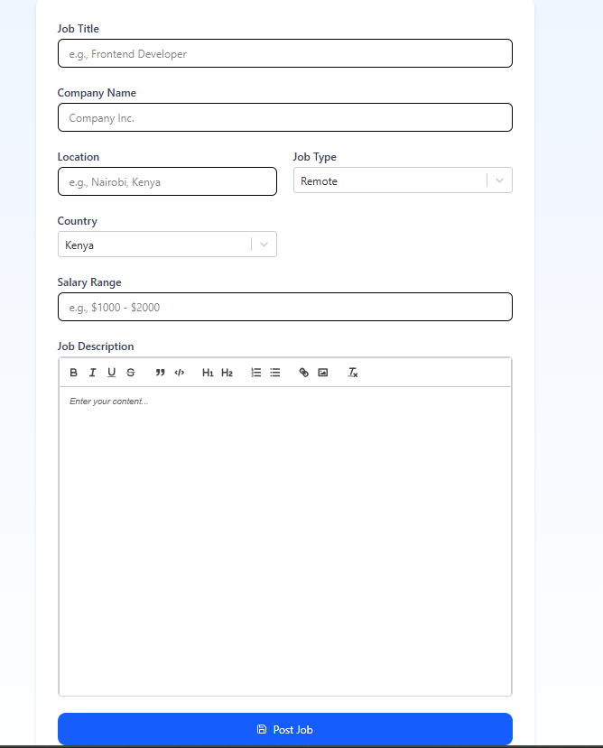

# 🧑‍💼 HireHub – Job Board Platform

HireHub is a full-featured Job Board platform where Recruiters and Employers can post jobs, and Job Seekers can apply for them. Built with **React** and **Supabase**, it includes real-time updates, role-based dashboards, and dynamic job management.

---

## 🚀 Features

### 👥 User Roles

- **Admin**: Manage all users, jobs, and applications.
- **Recruiter / Employer**: Post jobs, manage applications, view stats.
- **Job Seeker**: Browse jobs, apply, and track application status.

### 🧰 Functionality

- 🔐 Authentication (Email/Password via Supabase)
- 📝 Rich job posting form with [Quill.js] editor
- 📍 Auto-detect recruiter location by IP
- 🗂️ Role-based dashboards with real-time notifications
- 📊 Admin analytics: charts, counters, and user/job metrics
- 🌍 Country selector with flags using `react-select-country-list`
- 💬 Notifications system (read/unread, per-role access)
- 🔄 Real-time updates (applications, jobs, notifications)

---

## 🖥️ Tech Stack

| Tech               | Description                           |
| ------------------ | ------------------------------------- |
| ⚛️ React           | Frontend UI                           |
| 🧪 Supabase        | Backend (Auth, DB, Realtime, RLS)     |
| 📦 React Select    | Country & Job type dropdowns          |
| 📜 Quill           | Rich text editor for job descriptions |
| 🧭 React Router    | Page routing                          |
| 🔔 React Hot Toast | Alerts and notifications              |

---

## 📸 Screenshots

### 🧑‍💼Admin Dashboard

### 📄 Post Job

### 🏠 Home Page

🛡️ Role-Based Access
Role Access
Admin All users, jobs, and notifications
Recruiter Post jobs, view applicants
Employer Same as recruiter (optional separation)
User Apply for jobs, manage applications

🧑‍💻 Author
Built with ❤️ by Ibrahim Buthul
